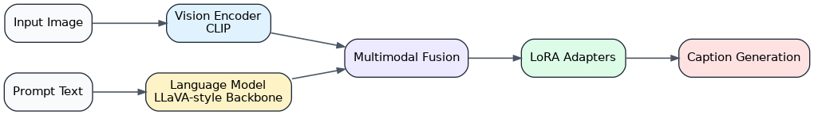
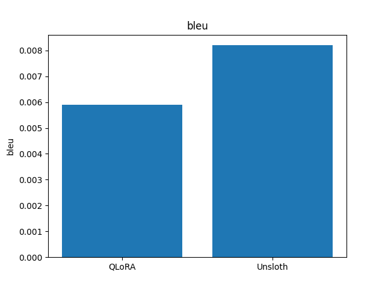
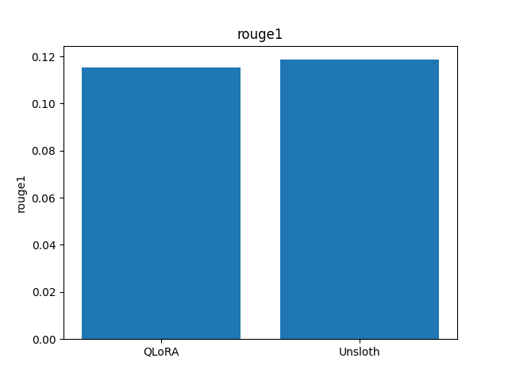
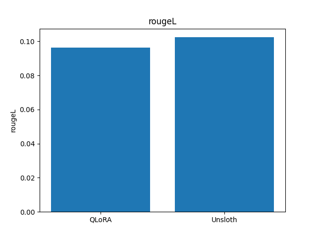

# VLM Finetuning Pipeline

<p align="center">
  <strong>Benchmarking QLoRA vs Unsloth for multimodal fine-tuning with an end-to-end, demo-ready workflow.</strong>
</p>

<p align="center">
  
  
  
  
  
  
</p>

---

## Problem

Fine-tuning vision-language models is usually hard to compare fairly.

Most projects stop at training code, but a strong benchmark needs more than that:

- validated multimodal data
- repeatable training runs
- apples-to-apples evaluation
- readable benchmark outputs
- a demo that non-technical people can try

This repo exists to turn that into one clean workflow for comparing **QLoRA** and **Unsloth** on the same captioning task.

---

## Solution

This repository packages a full **vision-language model fine-tuning benchmark** into a workflow that is easy to run, explain, and demo.

It compares two parameter-efficient multimodal training strategies:

| Method | Focus |
| --- | --- |
| **QLoRA** | Faster fine-tuning throughput with Hugging Face PEFT + quantization |
| **Unsloth** | Lower-memory multimodal LoRA workflow with an optimized loading/training path |

The pipeline covers the full lifecycle:

- dataset download and validation
- dataset preparation for captioning
- QLoRA training and evaluation
- Unsloth training and evaluation
- benchmark comparison and charts
- markdown + PDF report generation
- interactive Gradio demos for both models

Current workspace facts:

- Requested download target: `100` images
- Current valid prepared samples: `65`
- Task prompt used in training: `Describe the image.`
- Corrupt downloads are filtered during download and again during dataset preparation

---

## Architecture


Core model idea:



Repository layout:

```text
VLM-Finetuning-Pipeline/
├── configs/
│   └── experiment.yaml
├── data/
│   ├── raw/
│   └── processed/
├── models/
│   ├── qlora/
│   └── unsloth/
├── reports/
├── scripts/
│   ├── download_dataset.py
│   ├── prepare_dataset.py
│   ├── train_qlora.py
│   ├── train_unsloth.py
│   ├── evaluate.py
│   ├── benchmark.py
│   ├── generate_report.py
│   ├── generate_diagram.py
│   ├── export_report_pdf.py
│   └── demo.py
├── utils/
│   ├── metrics.py
│   └── vision_collator.py
├── run_pipeline.py
├── showcase.py
└── start_project.sh
```

---

## Demo Command

If you want to show this project to someone, use this:

```bash
cd /home/ubuntu/VLM-Finetuning-Pipeline
./start_project.sh
```

That single command will:

1. create `.venv` if needed
2. install Python dependencies if needed
3. reuse existing artifacts when available
4. otherwise run the full pipeline end to end
5. launch both demos
6. print the report, PDF, and diagram paths

Fast relaunch without rerunning the pipeline:

```bash
./start_project.sh --skip-pipeline
```

Demo URLs when launched:

- QLoRA demo: `http://127.0.0.1:7860`
- Unsloth demo: `http://127.0.0.1:7861`

Direct launch examples:

```bash
python -m scripts.demo --model models/qlora --port 7860 --label QLoRA
python -m scripts.demo --model models/unsloth --port 7861 --label Unsloth
```

Best prompt for this project:

```text
Describe the image.
```

Installation if you want to set it up manually:

```bash
python -m venv .venv
source .venv/bin/activate
pip install -r requirements.txt
```

Optional system tools used by report export and diagrams:

```text
pandoc
wkhtmltopdf
graphviz
```

---

## Results

Latest verified artifacts in this workspace were generated on a cleaned dataset of **65 samples**.

| Metric | QLoRA | Unsloth |
| --- | ---: | ---: |
| Training time (s) | 30.74 | 84.59 |
| Tokens / second | 1245.66 | 452.72 |
| Peak VRAM (GB) | 12.41 | 4.68 |
| BLEU | 0.0059 | 0.0082 |
| ROUGE-1 | 0.1152 | 0.1186 |
| ROUGE-L | 0.0963 | 0.1024 |
| Avg generation time (s) | 2.2602 | 3.7867 |
| Samples evaluated | 65 | 65 |

Quick read:

- **QLoRA** is faster in this run.
- **Unsloth** uses less VRAM.
- Caption quality is close, with Unsloth slightly ahead on the current aggregate metrics.

### Training Time


### Throughput


### Peak VRAM


### Caption Quality







Generated outputs live in [`reports/`](reports):

- `reports/experiment_report.md`
- `reports/experiment_report.pdf`
- `reports/pipeline_diagram.png`
- benchmark chart PNGs for speed, memory, and caption quality

Useful manual commands:

```bash
python run_pipeline.py
python showcase.py --skip-pipeline
python -m scripts.evaluate --model models/qlora
python -m scripts.evaluate --model models/unsloth
```

---

## Why This Matters

This repo is designed to be more than a training script dump.

It shows the ability to:

- build a reproducible multimodal PEFT benchmark
- compare QLoRA vs Unsloth side by side with real metrics
- turn raw experiment outputs into charts and reports
- ship a demo-ready project that another person can run with one command
- connect research-style evaluation with a practical product-style walkthrough

---

## License

MIT
