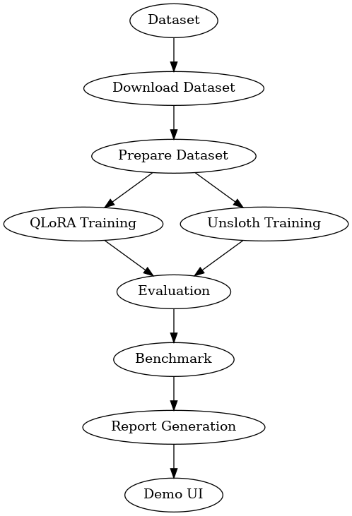
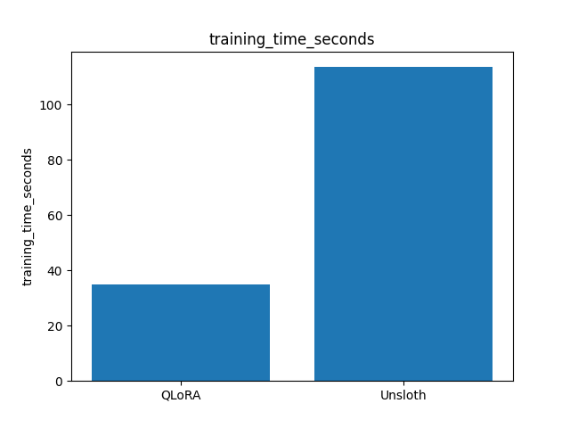
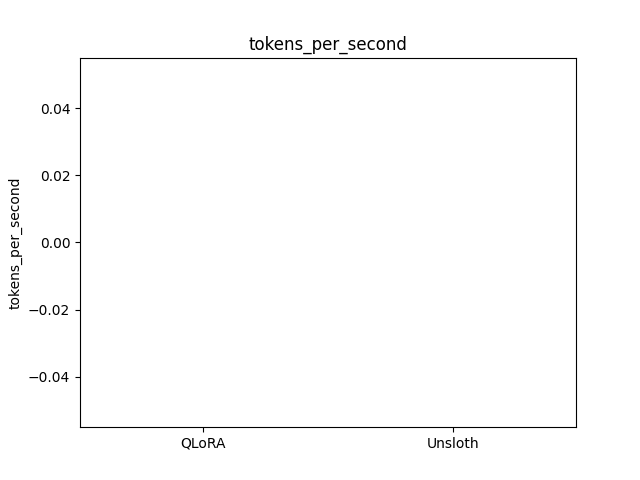
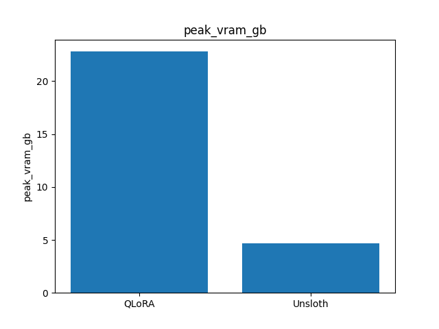

# Vision-Language Model Fine-Tuning Benchmark  
### QLoRA vs Unsloth for Multimodal Training


---

# Vision-Language Model Fine-Tuning Benchmark

This repository implements a **reproducible research pipeline** for benchmarking parameter-efficient fine-tuning methods for **Vision-Language Models (VLMs)**.

The project compares two modern training techniques:

| Method | Description |
|------|------|
| **QLoRA** | Quantized Low-Rank Adaptation using HuggingFace PEFT |
| **Unsloth** | High-performance LoRA training framework optimized for faster training |

The pipeline performs the entire experiment automatically:

- dataset preparation  
- multimodal fine-tuning  
- model evaluation  
- benchmark measurement  
- automatic report generation  
- architecture diagram generation  
- interactive demo deployment  

---

# System Architecture



Training workflow:

```
Dataset
   ↓
Download Script
   ↓
Dataset Preprocessing
   ↓
Training
 ├─ QLoRA
 └─ Unsloth
   ↓
Evaluation
   ↓
Benchmark Metrics
   ↓
Experiment Report
   ↓
Interactive Demo
```

---

# Benchmark Leaderboard

Results are generated automatically from training runs.

| Method | Training Time ↓ | Tokens / Second ↑ | Peak GPU VRAM ↓ |
|------|------|------|------|
| **QLoRA** | from benchmark.json | from benchmark.json | from benchmark.json |
| **Unsloth** | from benchmark.json | from benchmark.json | from benchmark.json |

---

# Training Metrics

The pipeline generates benchmark visualizations automatically.

## Training Time



## Training Throughput



## GPU Memory Usage



---

# Dataset

The experiment uses a **subset of Conceptual Captions**.

Configuration:

```
Requested download size: 100 images
Task: Image Captioning
Prompt: Describe the image
```

Current prepared dataset in this workspace:

```
Valid prepared samples: 65
Invalid downloaded images removed: 2
```

Dataset scripts:

```
scripts/download_dataset.py
scripts/prepare_dataset.py
```

The exact prepared sample count can vary depending on which image URLs are still reachable and which downloaded files pass image validation.

---

# Model Architecture

The multimodal architecture is inspired by **LLaVA-style models**.

Components:

```
Vision Encoder → CLIP
Language Model → LLaMA
Adapter Method → LoRA
```

The model learns to generate text conditioned on image input.

---

# Repository Structure

```
VLM-Finetuning-Pipeline/

configs/
    experiment.yaml

data/
    raw/
    processed/

models/
    qlora/
    unsloth/

reports/
    experiment_report.md
    experiment_report.pdf
    training_time_seconds.png
    tokens_per_second.png
    peak_vram_gb.png
    pipeline_diagram.png

scripts/
    download_dataset.py
    prepare_dataset.py
    train_qlora.py
    train_unsloth.py
    evaluate.py
    benchmark.py
    generate_report.py
    generate_diagram.py
    export_report_pdf.py
    demo.py

utils/
    vision_collator.py
    metrics.py

run_pipeline.py
requirements.txt
Dockerfile
docker-compose.yml
.dockerignore
README.md
```

---

# Installation

Create a virtual environment:

```bash
python -m venv .venv
source .venv/bin/activate
```

Install dependencies:

```bash
pip install -r requirements.txt
```

Optional system dependencies:

```
pandoc
wkhtmltopdf
graphviz
```

---

# Running the Full Experiment

Simplest handoff command:

```bash
./start_project.sh
```

What this one command does:

```
1. Creates .venv if needed
2. Installs Python dependencies if needed
3. Reuses existing trained artifacts when they already exist
4. Otherwise runs the full pipeline end to end
5. Launches both demos
   - QLoRA on port 7860
   - Unsloth on port 7861
6. Prints the report, PDF, and diagram paths for walkthroughs
```

You can also skip retraining and only relaunch the demos:

```bash
./start_project.sh --skip-pipeline
```

If you only want the pipeline without demos:

```bash
python run_pipeline.py
```

---

# Interactive Demo

The demo entrypoint now supports either model:

```bash
python -m scripts.demo --model models/qlora --port 7860 --label QLoRA
python -m scripts.demo --model models/unsloth --port 7861 --label Unsloth
```

When you use `./start_project.sh`, both are launched automatically.

Open the interfaces:

```
http://localhost:7860
http://localhost:7861
```

Best prompt for this project:

```
Describe the image.
```

---

# Example Model Output

```
The image shows several buses parked in a large parking area.
The buses appear to be aligned in rows, suggesting a bus terminal or depot.
```
